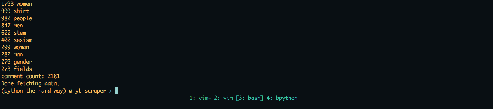
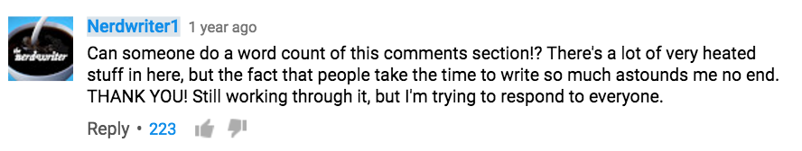

##Youtube Comment Scraper

##What is this poorly written code?
I'm glad you asked, this is my first attempt on a project that teaches me HTTP requests and to work against an API in python, namely the Youtube Data API. 

The idea came from a request by [Nerdwriter1](https://www.youtube.com/user/Nerdwriter1), a Youtuber that creates video essays:

It fetches all comments from a specific video you've given and spits out the top 10 words by frequency. 

It's not perfect, depending on the amount of comments you're retrieving there's a big chance some data is lost, for me it's been about 10% depending on the size. 

Strangely enough, on the Nerdwriter1 video I got more comments than what exists, haven't debugged and I'll probably leave it as it is for now.

**Note: it takes quite a lot of seconds to retrieve the data depending on the amount of comments being retrieved, I've done it on a 2000 comment video and it takes about 20-30 seconds unfortunately, so be patient**. 

Either my script is poorly written and therefor it's slow or it just takes a lot of time to request a lot of data from Youtube. 

I would love for this to be reviewed if anyone has any suggestions for improvements please mail me at bengtegardbook@gmail.com

##Usage
**Terminal**

`python word_frequency.py --developerkey="my_google_developer_api_key" --videoid="youtube video_ID"`

the "developer" option specifics the key that uniquely
identifies your google account for accessing youtube data API.

The "videoid" option specifies the YouTube video ID that uniquely identifies the video for which the comments will be fetched.

###Requirements
####Python 2.7.x
I have been running this script on python 2.7.10 on Mac OSX, it should work on other 2.7.x versions. 

####google-api-python-client 
You can use pip:  

`pip install --upgrade google-api-python-client`

You also need a google account and a developer key, you don't need to set up a OAuth, just make a project and create a new Public API access key. 
More instructions here: https://developers.google.com/youtube/v3/getting-started

###Thanks people on the internet
http://stackoverflow.com/questions/29692972/youtube-comment-scraper-returns-limited-results
http://programminghistorian.org/lessons/counting-frequencies

 